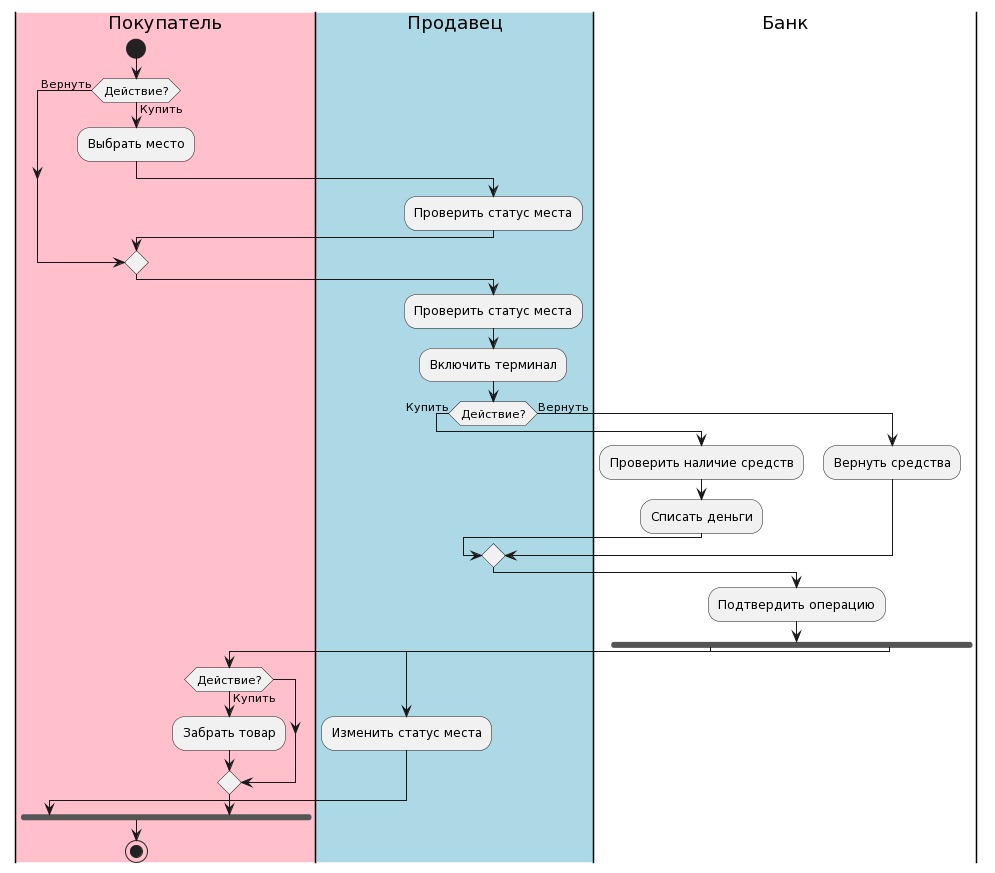

# TMP

## Практическая работа №0
```
@startuml
left to right direction
rectangle Касса {
Покупатель -- (Выбирает место)
Продавец -- (Проверяет наличие места)
(Проверяет наличие места) <. (Выбирает место)
(Покупатель) -- (Покупает товар)
(Оплачивает товар) <. (Покупает товар)
Покупатель -- (Забирает товар)
Банк -- (Проверяет наличие средств)
Банк -- (Подтверждает покупку)
(Подтверждает покупку) <. (Проверяет наличие средств)
(Проверяет наличие средств) <. (Оплачивает товар)
Продавец -- (Включает терминал)
(Оплачивает товар) <. (Включает терминал)
(Забирает товар) <. (Оплачивает товар)
(Покупает товар) <. (Проверяет наличие места)
Покупатель -- (Возвращает товар)
(Включает терминал) <. (Возвращает товар)
(Возвращает средства) <. (Включает терминал)
Банк -- (Возвращает средства)
(Забирает товар) <. (Подтверждает покупку)
}
@enduml
```


## Практическая работа №1
### Диаграмма вариантов использования
```
@startuml "Практическая работа 1"
left to right direction
title "Система продажи билетов на футбол"
actor Покупатель
actor Продавец
actor Банк

rectangle {
Покупатель -- (Выбрать место)
Покупатель -- (Забрать товар)
Покупатель -- (Оплатить товар)
Покупатель -- (Вернуть товар)
Продавец -- (Включить терминал)
Продавец -- (Проверить статус места)
Продавец -- (Изменить статус места)
Банк -- (Вернуть средства)
Банк -- (Подтвердить операцию)
Банк -- (Проверить наличие средств)
Банк -- (Списать средства)
(Выбрать место) ..> (Проверить статус места):<<include>>
(Проверить статус места) ..> (Включить терминал):<<include>>
(Включить терминал) ..> (Оплатить товар):<<include>>
(Оплатить товар) ..> (Проверить наличие средств):<<include>>
(Проверить наличие средств) ..> (Списать средства):<<include>>
(Списать средства) ..> (Подтвердить операцию):<<include>>
(Подтвердить операцию) ..> (Изменить статус места):<<include>>
(Подтвердить операцию) ..> (Забрать товар):<<include>>
(Вернуть товар) -- (Проверить статус места):<<include>>
(Включить терминал) ..> (Вернуть средства):<<include>>
(Вернуть средства) ..> (Подтвердить операцию):<<include>>
}
@enduml
```


```
@startuml
!theme spacelab
class Покупатель {
+ ФИО
+ Деньги
Выбрать место()
Забрать товар()
Оплатить товар()
}

class Продавец {
+ ФИО
Включить терминал()
Проверить наличие места()
}

class Банк {
Вернуть средства()
Подтвердить покупку()
Проверить наличие средств()
Списать средства()
}

class Товар {
+ номер места
+ тип
}
@enduml
```
