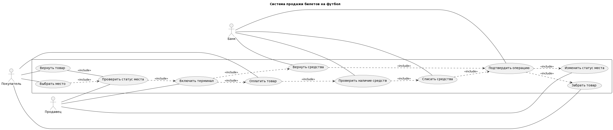

# TMP

## Практическая работа №0
```
@startuml
left to right direction
rectangle Касса {
Покупатель -- (Выбирает место)
Продавец -- (Проверяет наличие места)
(Проверяет наличие места) <. (Выбирает место)
(Покупатель) -- (Покупает товар)
(Оплачивает товар) <. (Покупает товар)
Покупатель -- (Забирает товар)
Банк -- (Проверяет наличие средств)
Банк -- (Подтверждает покупку)
(Подтверждает покупку) <. (Проверяет наличие средств)
(Проверяет наличие средств) <. (Оплачивает товар)
Продавец -- (Включает терминал)
(Оплачивает товар) <. (Включает терминал)
(Забирает товар) <. (Оплачивает товар)
(Покупает товар) <. (Проверяет наличие места)
Покупатель -- (Возвращает товар)
(Включает терминал) <. (Возвращает товар)
(Возвращает средства) <. (Включает терминал)
Банк -- (Возвращает средства)
(Забирает товар) <. (Подтверждает покупку)
}
@enduml
```


## Практическая работа №1
### Диаграмма вариантов использования
```
@startuml "Практическая работа 1"
left to right direction
title "Система продажи билетов на футбол"
actor Покупатель
actor Продавец
actor Банк

rectangle {
Покупатель -- (Выбрать место)
Покупатель -- (Забрать товар)
Покупатель -- (Оплатить товар)
Покупатель -- (Вернуть товар)
Продавец -- (Включить терминал)
Продавец -- (Проверить статус места)
Продавец -- (Изменить статус места)
Банк -- (Вернуть средства)
Банк -- (Подтвердить операцию)
Банк -- (Проверить наличие средств)
Банк -- (Списать средства)
(Выбрать место) ..> (Проверить статус места):<<include>>
(Проверить статус места) ..> (Включить терминал):<<include>>
(Включить терминал) ..> (Оплатить товар):<<include>>
(Оплатить товар) ..> (Проверить наличие средств):<<include>>
(Проверить наличие средств) ..> (Списать средства):<<include>>
(Списать средства) ..> (Подтвердить операцию):<<include>>
(Подтвердить операцию) ..> (Изменить статус места):<<include>>
(Подтвердить операцию) ..> (Забрать товар):<<include>>
(Вернуть товар) -- (Проверить статус места):<<include>>
(Включить терминал) ..> (Вернуть средства):<<include>>
(Вернуть средства) ..> (Подтвердить операцию):<<include>>
}
@enduml
```


### Диаграмма классов
```
@startuml "Практическая работа 1"
class Покупатель {
+ ФИО
+ Деньги
Выбрать место()
Забрать товар()
Оплатить товар()
Вернуть место()
}

class Продавец {
+ ФИО
Включить терминал()
Проверить статус места()
Изменить статус места()
}

class Банк {
Вернуть средства()
Подтвердить покупку()
Проверить наличие средств()
Списать средства()
}

class Товар {
+ номер места
+ день и время
+ статус
}

class Билет {
+ номер места
+ день и время
+ статус
}

class Абонемент {
+ номер места
+ день и время
+ статус
}

Билет ..> Товар
Абонемент ..> Товар
Покупатель --> Товар:Выбирает
Продавец -- Товар:Проверяет статус
Продавец -- Банк:Проверять статус оплаты
Продавец --> Товар:Изменить статус
Покупатель --> Банк:Оплатить товар
Банк --> Покупатель:Вернуть деньги

@enduml
```


## Практическая работа №2
### Диаграмма активностей
```
@startuml
|#pink|Покупатель|
start
if (Действие?) is (Купить) then
:Выбрать место;
|#lightblue|Продавец|
:Проверить статус места;
else (Вернуть)
endif

|#lightblue|Продавец|
:Проверить статус места;
:Включить терминал;

if (Действие?) is (Купить) then
|Банк|
:Проверить наличие средств;
:Списать деньги;
else (Вернуть)
|Банк|
:Вернуть средства;
endif
:Подтвердить операцию;

fork
|Продавец|
:Изменить статус места;
fork again
|Покупатель|
if (Действие?) is (Купить) then
:Забрать товар;
endif
endfork

stop
@enduml
```


### Диаграмма последовательностей
```
@startuml
participant Покупатель as Foo
participant Продавец as Foo1
participant Терминал as Foo2
participant Банк as Foo3

Foo -> Foo1 : Выбрать место
Foo1 -> Foo2 : Включить терминал
Foo1 -> Foo : Разрешить оплату
Foo -> Foo2 : Приложить карту и ввести пинкод
Foo2 -> Foo3 : Оплатить
Foo3 -> Foo2 : Подтвердить оплату
Foo2 -> Foo1 : Сообщить о завершении оплаты
Foo1 -> Foo : Выдать билет
@enduml
```


### Диаграмма развертывания
```
@startuml
database Билеты
node Покупатель
node Продавец
node Терминал
node Банк

Покупатель - Билеты: Выбирает
Продавец - Билеты: Продает
Продавец - Терминал: Включает
Покупатель - Терминал: Оплачивает
Терминал - Банк: Отправка данных об оплате
Банк - Терминал: Подтверждение оплаты
Терминал - Продавец: Подтвердить оплату
Продавец - Покупатель: Выдать билет
@enduml
```


## Практическая работа №3
### Стратегия
```
class AuthMethod:
    def auth(self):
        ...

class Auth0(AuthMethod):
    def auth(self):
        print("Method 0")

class Auth1(AuthMethod):
    def auth(self):
        print("Method 1")

class Auth2(AuthMethod):
    def auth(self):
        print("Method2")

class AuthRun:
    def __init__(self, methodN):
        self.method = self.chooseMethod(methodN)
    def chooseMethod(self, N):
        self.method = AuthMethod()
        if N == 0:
            self.method = Auth0()
        if N == 1:
            self.method = Auth1()
        if N == 2:
            self.method = Auth2()
        return self.method.auth

a = AuthRun(0)
a.method()
```

### Шаблонный метод
```
class Algo:
    def step1(self):
        pass
    def step2(self):
        pass
    
class A(Algo):
    def step_1(self):
        print('Step A 1')
    def step_2(self):
        print('Step A 2')

class B(Algo):
    def step_1(self):
        print('Step B 1')
    def step_2(self):
        print('Step B 2')
    def something(self):
        print('do something else')
```
